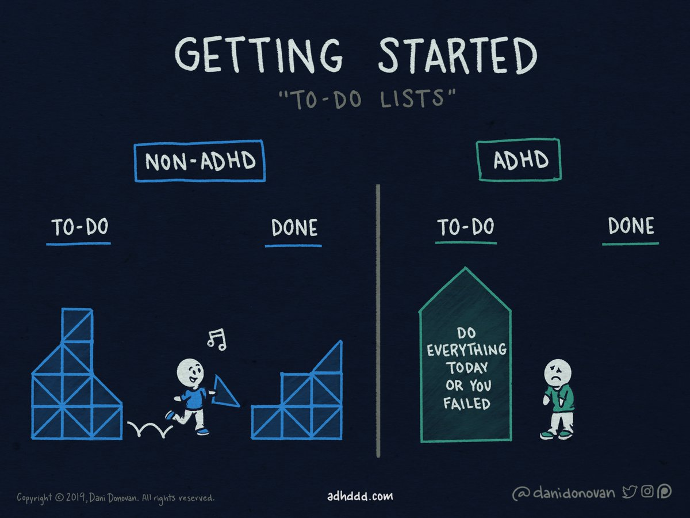
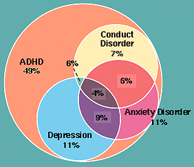
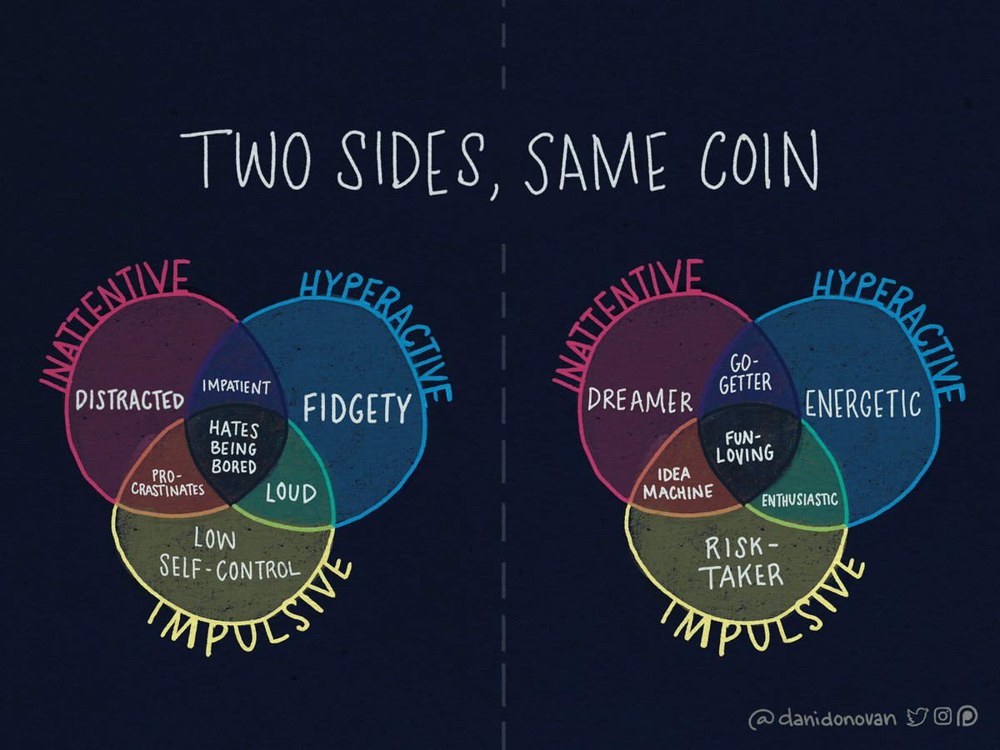

footer: © Daniel Kolkena
slidenumbers: true
autoscale: true
build-lists: true

# Intro

Attention Deficit/Hyperactivity Disorder is a neurodevelopmental disorder that affects up to 5% of adults. It’s an often misunderstood condition that can significantly affect one’s personal and professional life. I’m excited to share insights from a career full of highs and lows managing Adult ADHD and some tools for anyone, ADHD or not, interested in improving their productivity.

---

# About the Presenter

Daniel Kolkena is a Senior DevOps Engineer with 10 years of industry experience in system administration, software development, and application support. This, despite dropping out of college–twice! He’s passionate about tooling, process optimization, self-improvement, and music from the 80s.

---

# Disclaimers

**I’m an engineer, dammit, not a doctor!** This talk is _not_ intended to be a substitute for professional medical advice, diagnosis, or treatment. Always seek the advice of your physician or other qualified health provider with any questions you may have regarding a medical condition.

I have received _no_ compensation for any recommendations I make of treatments, techniques, or products. The information and advice contained herein is solely the result of my own research and experience.

---
[.build-lists: false]
# What will this talk cover?

1. What is ADHD
1. What can I do about it?

---
[.hide-footer]

# What is ADHD?

---
[.build-lists: false]
## What is ADHD?

>_“A lifelong, persistent pattern of inattention and/or hyperactivity-impulsivity that interferes with functioning or development across time and settings.”_

* Was described as “ADD” in DSM-III in 1980
* Formally defined as “ADHD” in DSM-IV in 1994
* Current definition has 3 subtypes: **Predominantly Inattentive**, **Predominantly Hyperactive-Impulsive**, and **Combined Presentation**
* The condition onsets in childhood. Up to 5% of children may meet the diagnostic criteria. 1/3 to 2/3 of children diagnosed will continue to exhibit symptoms through adulthood.

---
[.build-lists: false]

# [fit] DSM diagnostic criteria for **Inattention**

* Often fails to give close attention to details or makes careless mistakes in schoolwork, at work, or with other activities.
* Often has trouble holding attention on tasks or play activities.
* Often does not seem to listen when spoken to directly.
* Often does not follow through on instructions and fails to finish schoolwork, chores, or duties in the workplace (e.g., loses focus, side-tracked).
* Often has trouble organizing tasks and activities.
* Often avoids, dislikes, or is reluctant to do tasks that require mental effort over a long period of time (such as schoolwork or homework).
* Often loses things necessary for tasks and activities (e.g. school materials, pencils, books, tools, wallets, keys, paperwork, eyeglasses, mobile telephones).
* Is often easily distracted
* Is often forgetful in daily activities.

^ For adults, at least 5 symptoms are required.

---
[.build-lists: false]

# [fit] DSM diagnostic criteria for **Hyperactivity and Impulsivity**

* Often fidgets with or taps hands or feet, or squirms in seat.
* Often leaves seat in situations when remaining seated is expected.
* Often runs about or climbs in situations where it is not appropriate (adolescents or adults may be limited to feeling restless).
* Often unable to play or take part in leisure activities quietly.
* Is often “on the go” acting as if “driven by a motor”.
* Often talks excessively.
* Often blurts out an answer before a question has been completed.
* Often has trouble waiting his/her turn.
* Often interrupts or intrudes on others (e.g., butts into conversations or games)

^ For adults, at least 5 symptoms are required.

---
[.build-lists: false]

# Further diagnostic criteria

In addition to the previous criteria, you must have

* Several inattentive or hyperactive-impulsive symptoms were present prior to age 12 years.
* Several inattentive or hyperactive-impulsive symptoms are present in two or more settings (e.g., at home, school, or work; with friends or relatives; in other activities).
* There is clear evidence that the symptoms interfere with, or reduce the quality of, social, academic, or occupational functioning.
* The symptoms do not occur exclusively during the course of schizophrenia or another psychotic disorder and are not better explained by another mental disorder (e.g., mood disorder, anxiety disorder, dissociative disorder, personality disorder, substance intoxication or withdrawal).

---

# Areas of Difficulty Managing Daily Activities

* Poor self-management relative to time, planning, and goals
* Poor self-organization, problem solving, and working memory
* Poor self-discipline (inhibition)
* Poor self-motivation
* Poor self-activation, concentration, and alertness

^ Executive function: Persistent poor time management, impaired executive function, impulsivity, failing to start

---

# Comorbidities

* Depression
* Anxiety
* Oppositional Defiant Disorder (and Conduct Disorder)
* Tic disorders
* Autism spectrum disorders

^ Depression: could be reaction to environmental stressors, or sometimes correlate with bipolar (impulsivity)

^ Anxiety: mood swings, lack of energy, low self-esteem, imposter syndrome

^ ODD: refusing to comply with rules, frequent periods of anger/resentfulness

^ Tics could include vocal tics, motor tics, nervous habits like nail biting/nose picking/hair pulling, even Tourette's

^ Spectrum disorders share some elements with ADHD but is a separate diagnosis

---
[.build-lists: false]

# Imposter Syndrome

* A feeling that any success or achievement is due to luck and not one's own talent or effort
* A persistent fear of being exposed as a "fraud"
* A feeling that you "don't belong here"

Remember: _actual_ imposters almost never suffer from imposter syndrome.

You can do the hard thing!

^ This is a HUGE thing in tech!

^ Pattern of failure -> low self-esteem

^ These feelings of inadequacy can linger despite significant evidence to the contrary

---

# Causes of ADHD

* There’s no scientific consensus on a single cause
* Research points to a heavily genetic component; there’s evidence for environmental factors as well
* Predominant theory: dopamine and norepinephrine neurotransmitters don’t work the same way a neurotypical brain does, so we don’t receive the standard reward feedback for accomplishing tasks

^ Discuss myths: sugar, caffeine, the teevee, that dang rock music that all the kids listen to

^ Reward feedback loop

---

# How does this affect my life?

* Work
* Relationships
* Finances
* Health

^ Work: Intelligent but underperformed in school, Project an incorrect professional perception, Taking all day to complete a 15 minute task, Procrastinating and poor planning, Inflating progress during standup

^ Relationships: Forgetting important dates and info, giving the perception of ignoring or undervaluing significant other

^ Finance: Forgetting bills, poor money planning due to impulsivity

^ Health: Poor diet due to lack of planning and impulsiveness, failing to follow through long term with plans, putting off or forgetting doctor appts

---

# If you’re not sure: get a professional diagnosis

Your primary care physician can refer you to a licensed clinician, such as a neurologist or psychiatrist

These tests can be long, stressful, and expensive, but is the only way to be officially diagnosed

^ Everyone experiences these symptoms in a limited capacity. It reaches the level of a diagnosable illness if it's chronic, pervasive, and negatively affects your quality of life

---
[.hide-footer]

# Management strategies and mitigation techniques

---

# Professional treatment

* Cognitive Behavioral Therapy (CBT)
* ADHD Coaching
* Medication

^ CBT focuses on improving habits and behavior by practicing healthy coping mechanisms

---

# Medication

* Stimulant: Adderall, Ritalin, Concerta, Vyvanse
* Non-stimulant: Strattera, Clonidine, Guanfacine
* Everyone reacts differently to different medications
* Work with your doctor to find what works for you

^ Stimulant meds trick the brain into producing chemicals at a rate much closer to that of neurotypical brains. Many of us already self-medicate with caffeine!

^ Side effects include lack of appetite, restlessness, mild euphoria, small potential for abuse if not used as indicated by doctor

^ Non-stimulant medications help by boosting norepinephrine, decreasing impulsivity – less risk of abuse, take longer to work

^ There is no single drug that works for everyone! Figuring out drug/dosage is a process with your doc

---

# Non-medication treatment

Exercise, sleep, and good nutrition can help but do not represent a comprehensive treatment plan by themselves

---

# Optimize your work

* Find roles that leverage your strengths and minimize your weaknesses
* Our brains thrive on novelty, not routine

^ It could be our strengths are more aligned to reactive work instead of proactive work - Ops, Support, etc. Or we may be good at big picture architecture rather than routine bugfixes

---

# Be honest with yourself!

* Taking on too much leads to a cycle of overpromise/underdeliver and instills a sense of hopelessness and failure
* Look at your previous successes and failures and your work throughput. Use that to give yourself a baseline of what you can reasonably commit to.
* Give yourself buffer time to deliver your commitments. 2 story points but you’re not confident in the implementation details yet? Make it 3 or 5.
* Consistently delivering commitments on time–even if it’s less than you think you might be capable of–will give you confidence and develop your reputation.

---

# Time management strategies

* Pomodoro, timeboxing, pair programming
* Browser extensions/apps to disable or eliminate distractions (email, social media)
* Physical planner

^ We're bad at time management, and any system we use to fix that needs to take that into account

---
[.build-lists: false]
# Organizational tools

* OneNote, Evernote, G-suite, Trello, Workflowy, Airtable, Todoist, Notion.so
* CLI tools
* Physical notebook w/ pen

Don't be afraid to evaluate different tools to figure out what works for _you_.

^ Take notes constantly, this can make all the difference. Don't be afraid to invest lots of "overhead" time into writing and reviewing notes

^ Story of taking notes and being always prepared at Sorenson when asked for info

---

# Workspace changes

* Darker dev environment (Eliminate visual distractions)
* Dark UI, IDE
* Quiet space/headphones
* Work with team to establish optimum communication channels

---

# Communication with management and team

* ADA legally protects “reasonable accommodation” requests
* Can ask for shorter feedback cycles
* Detailed acceptance criteria
* Communications in whatever manner works best for your cognition and retention (face to face/conference calls/group chat/email)
* Don’t be afraid to ask for help!
* Ask about mentorships (a great resource for a professional at any stage in their career!)
* **Caveat:** professional risk

^ Being upfront about your needs can be reassuring to your team and supervisor

^ Can project a sense of laziness or casualness that doesn't describe the real you

^ Some people believe it doesn’t exist/is an excuse for laziness

---

^ We have cognitive challenges that affect our lives, but they can also be a source of our unique creative power

^ We're patient, empathetic, and compassionate; able to see big picture ideas, be passionate about what drives us

^ You can do the hard thing!

---

## Questions?

Feel free to reach out!

Email: daniel.kolkena@gmail.com
**@dkolkena** on Twitter

---
[.build-lists: false]
### Resources

* *Taking Charge of Adult ADHD* by Russell A Barkley
* https://www.addrc.org/dsm-5-criteria-for-adhd/
* https://www.nimh.nih.gov/health/topics/attention-deficit-hyperactivity-disorder-adhd/index.shtml
* https://www.reddit.com/r/ADHD/
* https://en.wikipedia.org/wiki/Attention_deficit_hyperactivity_disorder
* https://en.wikipedia.org/wiki/Adult_attention_deficit_hyperactivity_disorder
* https://add.org/adhd-facts/
* https://adhddd.com

---

<!--

# Photo and art credit

* Photo by [Erik Mclean](https://unsplash.com/photos/Tso1j6dz0H8) on [Unsplash](https://unsplash.com)
* Photo by [Aravind Vijayan](https://unsplash.com/photos/Go6jxhtleYs) on [Unsplash](https://unsplash.com)
-->
